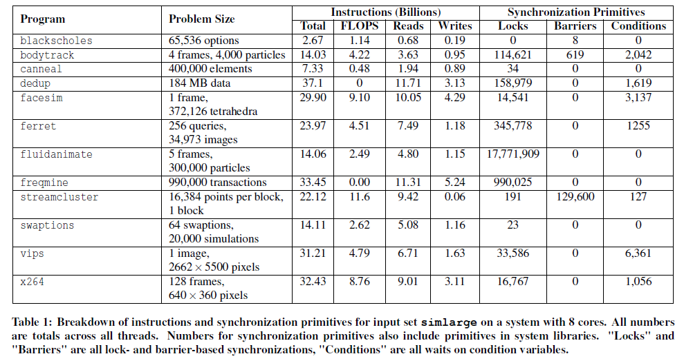
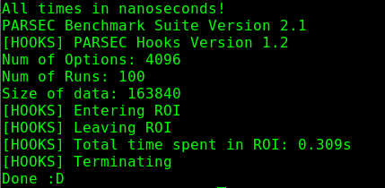
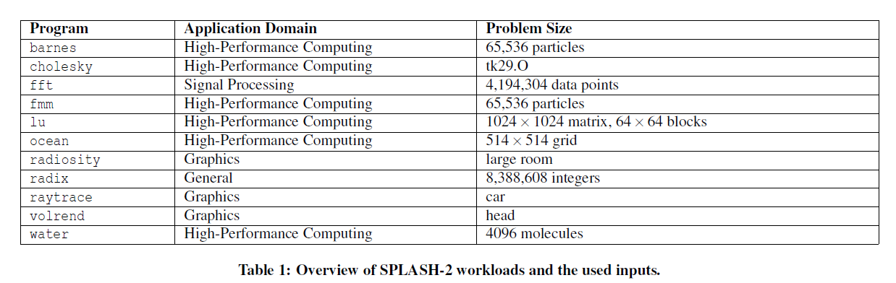
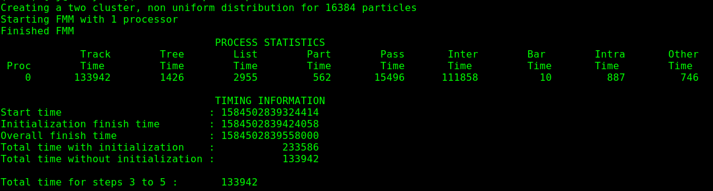
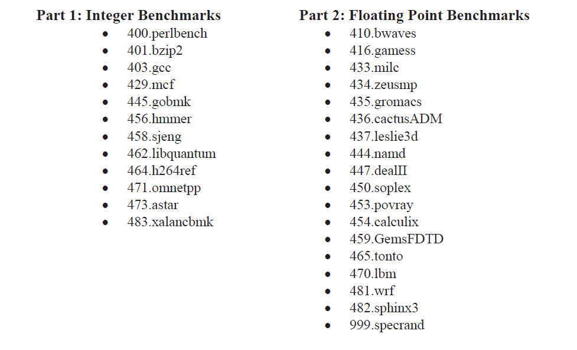
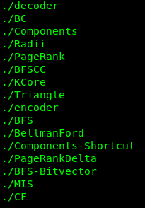
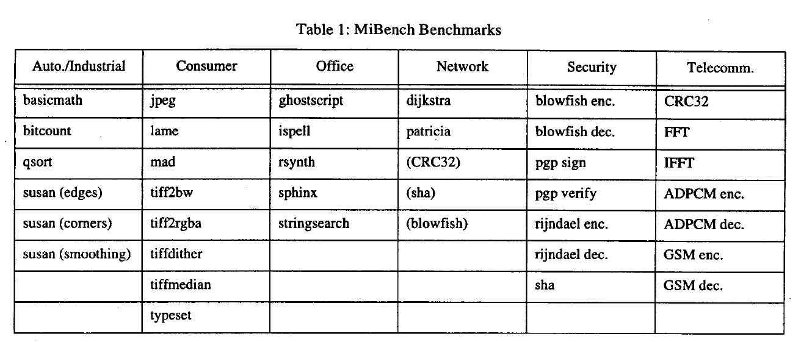

# Benchmark
## PARSEC
### Introduction
The Princeton Application Repository for Shared-Memory Computers (PARSEC) is a benchmark suite for studies of `Chip-Multiprocessors (CMPs)`. PARSEC includes emerging applications in recognition, mining and synthesis (RMS) as well as systems applications which mimic large-scale multithreaded commercial programs.
### Details
#### Input Sets
Define six input sets for each benchmark : test, simdev, simsmall, simmedium, simlarge and native.
#### Workloads
`blackscholes` : calculates the prices for a portfolio of European options

`bodytrack` : computer vision algorithms

`canneal` :  minimize the routing cost of a chip design

`dedup` : compresses a data stream with a combination of global and local compression

`facesim` : models face by simulating the underlying physics

`ferret` :  content-based similarity search

`fluidanimate` : physics simulations for animations

`freqmine` : data mining techniques

`streamcluster` : the online clustering problem

`swaptions` : price a portfolio of swaptions

`vips` : the VASARI Image Processing System

`x264` : video encoder



### Command
Based on `FS` mode
```javascript
// generate the run script for the m5 simulator
// filename: blackscholes_64c_simsmall.rcS
#!/bin/sh
# File to run the blackscholes benchmark
cd /parsec/install/bin
/sbin/m5 dumpstats
/sbin/m5 resetstats
./blackscholes-work 16 /parsec/install/inputs/blackscholes/in_4K.txt /parsec/install/inputs/blackscholes/prices.txt
echo "Done :D"
/sbin/m5 exit
/sbin/m5 exit

// add the command line to run 
--script=blackscholes_64c_simsmall.rcS
```
### Simulation Result
The PARSEC hooks are a set of functions which are called at specific locations by the workloads of the PARSEC benchmark suite. It defines a Region-Of-Interest (ROI) which includes the computationally intensive, parallelized phase of the benchmark, but not the initialization or shutdown phase.  



### Reference
[1] *Bienia, Christian, et al. "The PARSEC benchmark suite: Characterization and architectural implications." Proceedings of the 17th international conference on Parallel architectures and compilation techniques. 2008.*

## SPLASH2
### Introduction
The SPLASH-2 (Stanford ParalleL Applications for SHared memory) suite is one of the most widely used collections of `multithreaded workloads`. The majority of workloads belong to the High-Performance Computing domain.
### Details
#### Input Sets
#### Workloads

### Command
Based on `FS` mode
```javascript
//fmm.rcS
#!/bin/sh
cd /splash2/fmm
echo "Runing FMM now ..."
./FMM < inputs/input.16384
/sbin/m5 exit
// add the command line to run 
--script=fmm.rcS
```
### Simulation Result

### Reference
[1] *Woo, Steven Cameron, et al. "The SPLASH-2 programs: Characterization and methodological considerations." ACM SIGARCH computer architecture news 23.2 (1995): 24-36.*

[2] *Bienia, Christian, Sanjeev Kumar, and Kai Li. "PARSEC vs. SPLASH-2: A quantitative comparison of two multithreaded benchmark suites on chip-multiprocessors." 2008 IEEE International Symposium on Workload Characterization. IEEE, 2008.*

[3] *Poluri, Pavan, and Ahmed Louri. "An improved router design for reliable on-chip networks." 2014 IEEE 28th International Parallel and Distributed Processing Symposium. IEEE, 2014.*

## SPEC2006
### Introduction
 The SPEC CPU® 2006 benchmark is SPEC's (Standard Performance Evaluation Corporation) industry-standardized, `CPU-intensive` benchmark suite, stressing `a system's processor, memory subsystem and compiler`. SPEC designed this suite to provide a comparative measure of `compute-intensive performance` across the widest practical range of hardware using workloads developed from real user applications. 
### Details
More details can get from refs as below.
#### Input Sets
#### Workloads

### Command
### Reference
[1] *Henning, John L. "SPEC CPU2006 benchmark descriptions." ACM SIGARCH Computer Architecture News 34.4 (2006): 1-17.*

[2] *http://www.spec.org/cpu2006/*

[3] *Li, Ren-Min, Chung-Ta King, and Bhaskar Das. "Extending Gem5-garnet for efficient and accurate trace-driven NoC simulation." Proceedings of the 9th International Workshop on Network on Chip Architectures. 2016.*

## Ligra
### Introduction
Ligra is a lightweight graph processing framework for shared memory. It is particularly suited for implementing parallel graph traversal algorithms where only a subset of the vertices are processed in an iteration. 
### Details
#### Input Sets
#### Workloads

### Command
Based on `SE` mode
```javascript
-c my_benchmark/ligra/apps/BellmanFord -o '-round 64 my_benchmark/ligra/inputs/rMatGraph_WJ_5_100'
```
### Simulation Result

### Reference
[1] *Shun, Julian, and Guy E. Blelloch. "Ligra: a lightweight graph processing framework for shared memory." Proceedings of the 18th ACM SIGPLAN symposium on Principles and practice of parallel programming. 2013.*

[2] *https://github.com/jshun/ligra*

## E3S
### Introduction
The Embedded System Synthesis Benchmarks Suite (E3S) was designed for use in embedded systems synthesis research. In particular, it was designed for use in automated system-level allocation, assignment, and scheduling research.
### Details
#### Input Sets
#### Workloads
Five different problem:
- auto-indust
- networking
- telecom
- consumer
- office-automation

Three embedded system type:
- distributed system synthesis
- wireless client-server system
- `system-on-chip`

### Command
### Reference
[1] *Reza, Md Farhadur, Dan Zhao, and Hongyi Wu. "Task-resource co-allocation for hotspot minimization in heterogeneous many-core nocs." Proceedings of the 26th edition on Great Lakes Symposium on VLSI. 2016.*

[2] *http://ziyang.eecs.umich.edu/~dickrp/e3s/*

## MiBench
### Introduction
MiBench presents a set of 35 embedded applications for benchmarking purposes which divided into six suites with each suite targeting a specific area of the embedded market.
### Details
#### Input Sets
#### Workloads

### Command
### Reference
[1] *Guthaus, Matthew R., et al. "MiBench: A free, commercially representative embedded benchmark suite." Proceedings of the fourth annual IEEE international workshop on workload characterization. WWC-4 (Cat. No. 01EX538). IEEE, 2001.*

[2] *Charles, Subodha, et al. "Exploration of memory and cluster modes in directory-based many-core cmps." 2018 Twelfth IEEE/ACM International Symposium on Networks-on-Chip (NOCS). IEEE, 2018.*
