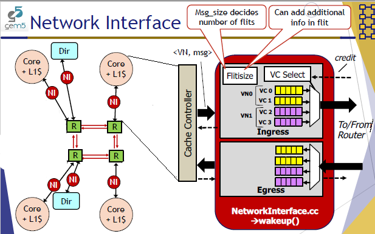
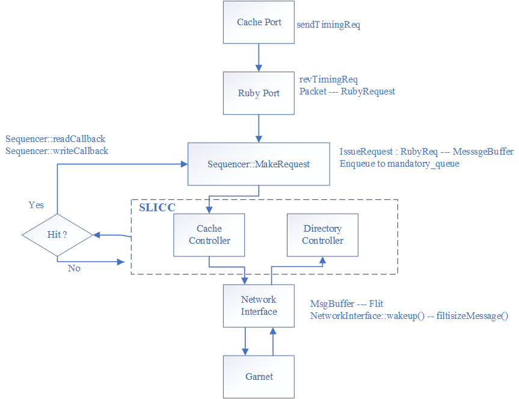
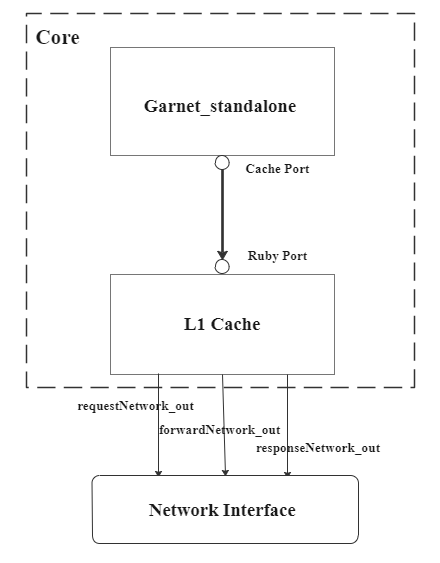
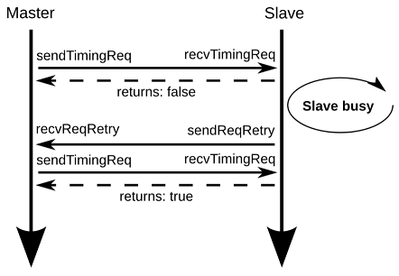
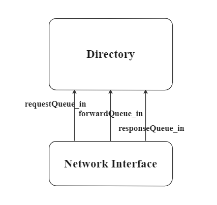
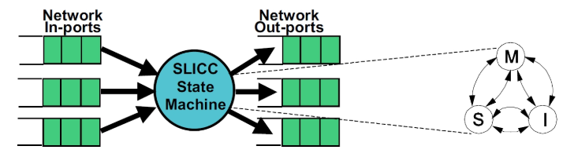

# Garnet_Standalone
## Overall structure



## Flow



## Core



### Tester
- Generate gem5 Packets depend on the synthetic traffic
- Have a Cache Port connected to Ruby Memory System
- **sendTimingReq**

### Cache
The role of the cache is to simply send messages from the cpu to the appropriate directory (based on the address), in the appropriate virtual network (based on the message type).

#### Ruby Port: 
- recvTimingReq return true to Cache Port
- RubyPort converts a gem5 packet to a **RubyRequest** object that is understood by various components of Ruby.
- The Sequencer feeds the memory subsystem (including the caches and the off-chip memory) with load/store memory requests from the processor. Every memory request when completed by the memory subsystem also send back the response to the processor via the Sequencer. 
- The Sequencer hit call back is performed after injecting the packets. The goal of the Garnet_standalone protocol is only to inject packets into the network, not to keep track of them via TBEs.

### Connection between tester and cache
The core sends request, after the **Sequencer::MakeRequest** and return the **RequsetStatus_Issued**, the **recvTimingReq** would return true.


## Directory
The goal of the directory is only to act as a destination node in the underlying interconnection network.


## Protocal
### SLICC
SLICC is a domain specific language for specifying cache coherence protocols. The SLICC compiler generates C++ code for different controllers, which can work in tandem with other parts of Ruby.



### Related Files
- `Garnet_standalone-cache.sm` : cache controller specification
- `Garnet_standalone-dir.sm` : directory controller specification
- `Garnet_standalone-msg.sm` : message type specification
- `Garnet_standalone.slicc` : container file

### Cache in Standalone
```javascript
  transition(I, Response) {//state I because Event Respose transform to I
    s_store_hit;
    c_issueResponse;
    m_popMandatoryQueue;
  }
  transition(I, Request) {
    r_load_hit;
    a_issueRequest;
    m_popMandatoryQueue;
  }
  transition(I, Forward) {
    r_load_hit;
    b_issueForward;
    m_popMandatoryQueue;
  }
```

### Dir in Standalone
```javascript
transition(I, Receive_Request) {
    i_popIncomingRequestQueue;
  }
  transition(I, Receive_Forward) {
    f_popIncomingForwardQueue;
  }
  transition(I, Receive_Response) {
    r_popIncomingResponseQueue;
  }
```
