# Cache Coherence in Gem5 and CHI
## MI in Gem5
This protocol assumes a 1-level cache hierarchy. The cache is private to each node. The caches are kept coherent by a directory controller.
### State
- **M**: The cache block has been accessed (read/written) by this node. No other node holds a copy of the cache block
- **I**: The cache block at this node is invalid

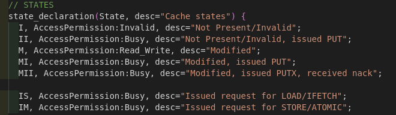

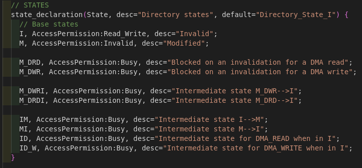

### Controller (event transition action)
#### Cache controller

##### Main operation
1.  `load/Instruction fetch/Store request` from the core: It checks whether the corresponding block is present in the M state. If so, it returns a hit. otherwise, if in I state, it would issue a request and initiates a GETX request from the directory controller.
2.  `replacement` trigger from self: It evicts the block, issues a writeback request to the directory controller. It waits for acknowledgement from the directory controller.
3.  `forwarded request` from the directory controller: It sends the block directly to the requesting node (cache-to-cache transfer) and evicts the block from this node.

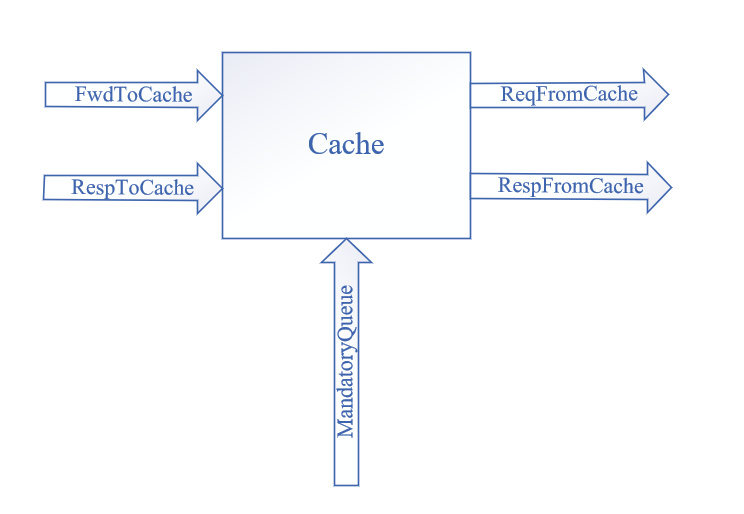

#### Directory controller

##### Main operation
1.   `GETX request` from a core: If the block is not present, a memory fetch request is initiated. If the block is already present, then it means the request is generated from some other core. In this case, a forwarded request is sent to the original owner Ownership of the block is transferred to the requestor.
2.   `writeback request` from a core: If the core is owner, the data is written to memory and acknowledgement is sent back to the core.
3.   `DMA accesses` (read/write): Invalidation is sent to the owner node (if any). Otherwise data is fetched from memory.

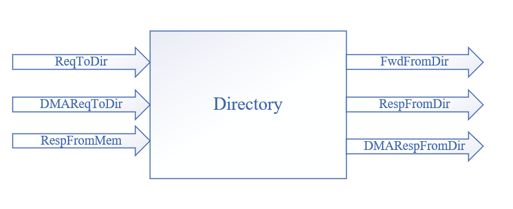

##### Port
- `DMAReqToDir`: DMA_READ and DMA_write
- `DMARespFromDir`: send Data or Ack to DMA
- `RespFromMem`: receive Mem_Data or Mem_Ack from Mem

#### DMA controller

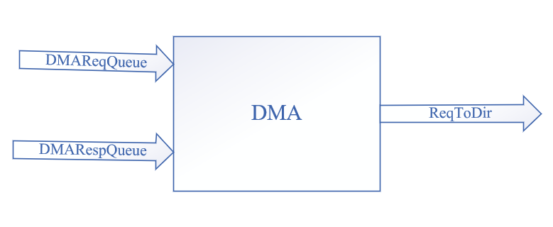

##### Port
- `DMARespQueue`: receive Data or Ack from Dir
- `ReqToDir`: DMA_READ or DMA_Write to Dir

### Example

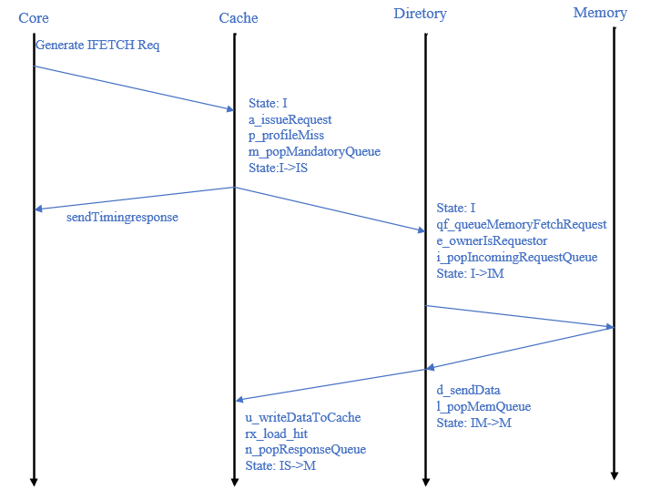

## CHI
### Overview
#### Coherency Model

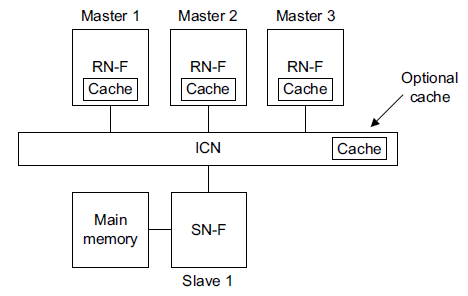

### State
- **Valid, Invalid**: When Valid, the cache line is present in the cache. When Invalid, the cache line is not present in the cache.
- **Unique, Shared**: When Unique, the cache line exists only in this cache. When Shared, the cache line might exist in more than one cache, but this is not guaranteed.
- **Clean, Dirty**: When Clean, the cache does not have responsibility for updating main memory. When Dirty, the cache line has been modified with respect to main memory, and this cache must ensure that main memory is eventually updated.
- **Full, Partial, Empty**: A Full cache line has all bytes valid. A Partial cache line might have some bytes valid, but not all bytes valid. An Empty cache line has no bytes valid.

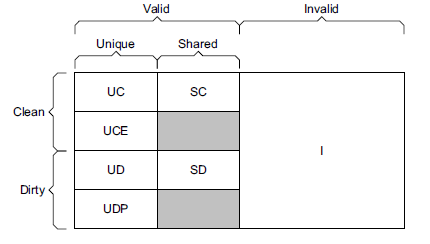

### example
#### Read transaction with DMT and with snoops
`ReadShared transaction`

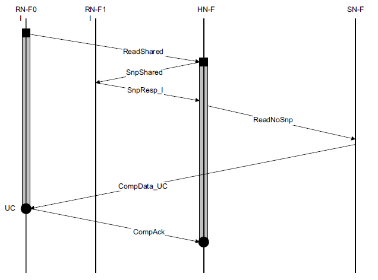

#### Read transaction with DCT
`ReadShared transaction`

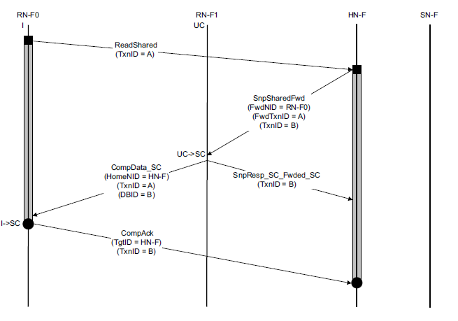

#### Write transaction with snoop and separate responses
`WriteUniquePtl transaction`

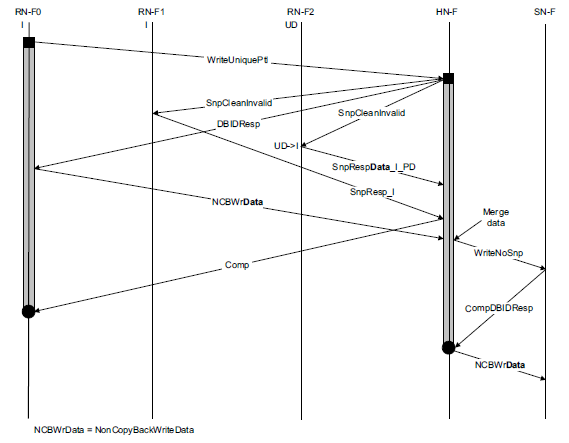
