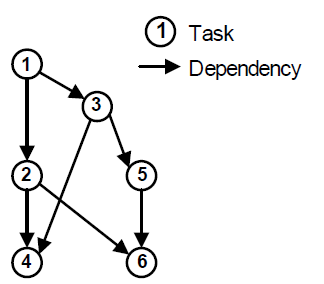
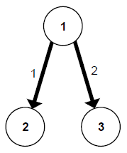
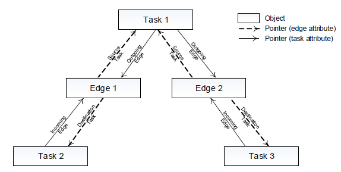

## Introduction
- A **Task Graph** is a directed graph $𝐺_𝑡=(𝑉,𝐸)$, where $𝑉$ is the set of computation tasks, and $𝐸$ is the set of communication channels between tasks.
- A task $𝑣$ has a normalized execution time $𝑡$.
- A directed edge $𝑒=(𝑣_𝑠,  𝑣_𝑑,  𝑤)$ has a source task $𝑣_𝑠$, a destination task $𝑣_𝑑$ and the amount of data 𝑤 that sends from $𝑣_𝑠$ to $𝑣_𝑑$. The edges represent both the control flow dependency and the data-dependency between tasks.

## Implementation Detail

- An **Edge** is composed by pointers to the source task and the destination task. It includes an interface that allows getting references to each of them and also information about the communication volume.

- A **Task** is composed by several edges (outgoing and incoming edges) that can be accessed by pointers as well. This construction defines a bidirectional linked tree between task-edge.

## Input
### Specification
- trace_type is set to 0.
- task_id, edge_id, processor_id is range from 0 to (amount -1).
- The task execution time follows the normal distribution by the given mu & sigma, and the unit is **clock cycle**.
- The communication volume called token size follows the normal distribution by the given mu & sigma, and the unit is 32bits.
- The token is split into packets, and the packets generate interval $t$ follow the $ -ln(a)/\lambda $ (a is random number range from 0 to 1).
- In memory and out memory are allocated for the communication among tasks.

### File Format

*******

trace_type  number_of_processor  number_of_task   num_of_edge

task_id mapped_processor_id schedule_number mu_for_task_execution_time_distribution sigma_for_task_execution_time_distribution

...(with the same number of rows as the tasks)

edge_id src_task_id dst_task_id src_proc_id dst_proc_id out_memory_start_address out_memory_size in_memory_start_address in_memory_size mu_for_token_size_distribution sigma_for_token_size_distribution lambda_for_packet_generation_interval_distribution

...(with the same number of rows as the edges)

*******
