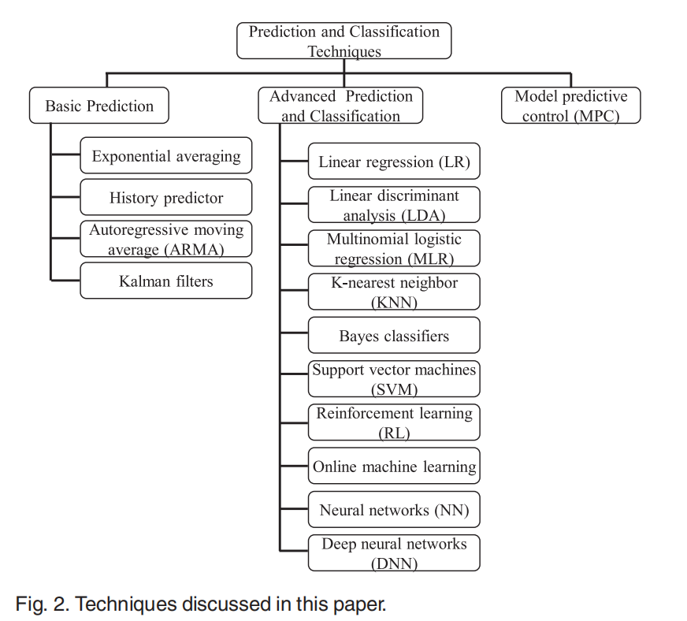

# A Survey of the Interconnection Network for Accelerator-rich Architectures

## 1 Introduction

  与通用的processor相比，accelerator可以提高几个数量级的处理速度，CPU对于时间延迟更敏感，而GPU之类的accelerator的throughput会受到accelerator与内存系统数据传输速率的限制，所以在异构的多核系统中，很有必要合理的设计interconnect network，使得CPU的时间延时小的同时，accelerator与内存系统之间数据传输延时也最小。

除此之外，一些如回归、ANN、RL的预测方法也可以应用到对于片上网络的数据通信预测中，可以对于一些如温度、道路拥塞等指标做出预测，从而对通信作出提前部署，减少latency等。

本文主要将之前的设计interconnect network及predictive methods的论文进行分类、总结分析。

## 2 Interconnect Network

### 2.1  Basic Interconnect

通常，通用processor或者主processor是由core和main memory组成，而accelerator由core、local memory组成，如何连接core和memory使得延时最小是本文研究的主要问题。

在论文[4]中提出了四种基本的interconnect，分别是：

1）Bus-based interconnect
2）NoC-based interconnect
3）Shared memory
4）Crossbar

主要是从scatability，system performance，area-efficiency三个方面衡量这些网络的性能。fig.1中，Bus-based interconnect空间利用率最高，NoC虽然scatability和performance都很好，但是area-efficiency不高，所以本文接下来主要总结了如何混合这些interconnect，使得性能达到最好。

    
     
    

      fig.1
  	

### 2.2 Hybrid Interconnection Architecture

#### 2.2.1 hybrid interconnect based on bus

最基本的Bus的interconnect如fig.2所示，图中假设两个kernel之间的数据传输是必须经过host processor，这样会消耗大量的时间，因此[4]将Bus与其他的结构结合：

    
     
    

      fig.2
  	

1）与DMA混合：两个kernel的local memory之间的数据传输使用DMA进行存取，节省了从Host processor传输的时间；

2）与crossbar混合：两个kernel的local memory之间的数据传输使用crossbar进行存取；

3）与DMA和crossbar同时混合：两个kernel的local memory之间的数据传输使用crossbar进行存取，其他的kernel可以使用DMA进行数据传输；

#### 2.2.2 interconnect based on shared-memory

基于shared-memory的interconnect的performance和空间利用率都很高，这种方法就是将数据存放在shared-memory中，这样可以减少从main-memory存取数据的时间。在accelerator和shared-memory之间用crossbar连接，设计连接方法使得switch的数量可以达到最少的同时interconnect的路由性能可以达到最优。根据accelerator是否具有相同的data port可以分成两种：

##### 1) the number of data port is uniform

当每个accelerator的data port都相等时，[1]借助以下三个特点优化连接，最终使得switch的数量在不影响路由性能的条件下达到最少：

a）相同加速器的多个数据端口一起通电/断开； 

b）芯片可以同时power的加速器个数是有限的；

c）异构的加速器同时被power的可能性小于同构的acceleraor.

##### 2) the number of data port is different

当每个accelerator的data port不相等时，[2]提出了memory bank对应accelerator的各个data port的分配算法,假设异构accelerator共有n个，最多能够power的数量为c个，首先对于accelerator按照data port数量d进行从大到小排序，然后将最多容纳的c个accumulator和memory bank进行一对一分配，并分成了c个region。然后将剩下的n-c个accelerator进行一对c分配，即在每个region内重新一轮分配，使得switch的数量在路由性能最优的情况下最小。

#### 2.2.3 hybrid interconnect based on NoC

基于NoC的interconnect的基本思想是将不同processor的core和memory分别连接到NoC上，但是NoC的area-efficiency很低，因为每一个网络的代价很大，[4]提出了将NoC与基于shared-memory结合，并设计了如何根据accelerator功能选择interconnect的算法。在NoC上传输的数据由于到达memory的时间是无序的，所以对于一个memory的数据存取会因为顺序问题产生延迟，[5]提出了一种基于token的network，对发向memory的request进行排序，从而使得memory的存取时间减少。[3]和[5]提出了一种将circuit-switching和packet-switching结合，利用hybrid-network传输数据的方法。

##### 1) hybrid-network based on time slot  

[5]将时间分成不同的时间slot，采用TDM的方式进行数据传输，针对CPU一般会选择packet-switching，而GPU之类的accelerator选用hybrid -switching,如fig.3所示：

    
     
    

      fig.3
  	

同时文章还提出基于circuit的两种链路共享方式：Hitchhiker-Sharing和Vicinity-Sharing，共享链路资源，节省链路搭建时间。

##### 2) hybrid-network based on GAM

[3]同样采用的是circuit-switching和packet-switching结合，与[5]相比不同的是，[3]提出了GAM管理的方法来选择数据传输的方式：文章假设有一个 global accelerator manager来协助进行动态负载平衡和任务调度，可以将任务按照预测传输时间进行排序，并对任务列表中的任务分配不同的router和buffer，并判断是选择circuit-switching还是packet-switching。

[25]中也提出了GAM的模型，如图所示，这里的主要是负责记录 accelerator IDs 的列表和相应 accelerator的 estimated wait times ，在core对某个accelerator预约之后，GAM将request的core的ID写入accelerator的等待列表里面并且按照FCFS执行。

### 2.3 Other optimization method 

除了上述方法，[4]提出了在设计interconnect的时候，应该是选择哪种interconnect的算法。文章首先提出了四种solution，然后根据QUAD toolset（即detailed profile），选择不同的解决方案。

[25]中还提出将accelerator进行串联或者组合成一个virtual accelerator来实现accelerator composition。

[26]中提出了一种针对异构SoC的双模式工作方法，可以根据电压的不同选择不同的工作模式，减少latency增大throughput。

[28]中提出了一种针对GPGPU的架构，由request plane和reply plane组成，还提出了GOM，通过叠加电路的使用实现减少时延和功耗。

## 3 Predictive Methods in the Optimization in the Network

   在多核处理器的系统中如果可以对某项参数进行预估，可以对以后的行为做出预判，从而选择最佳的方案，节省时间，节省能量消耗，提高效率。本部分主要调研了机器学习在系统预测中的应用，[6]中比较系统的介绍了各种预测方法的应用，如图所示。

### 3.1 Prediction and Classification Techniques

#### 3.1.1 Basic Prediction Techniques

首先介绍三种比较基本的预测方案：

1）History Predictor

这种方法主要优点是比较简单，易于在硬件上实现，可以用来预测拥堵的发生，[7]，[8]中提出这样可以适时更改路由器的工作频率，减少功率消耗。从而实现 dynamic voltage and frequency scaling (DVFS)，这样可以通过损失最少的性能来减少能量消耗。

2）Autoregressive Moving Average (ARMA) Model

ARMA模型的建立分为两个阶段:识别估计阶段和模型检验阶段。[9]，[10]中的ARMA模型主要应用在SoC的thermal management，预测热因子。

3）*Kalman Filters

一种用于预测离散控制过程状态x的自适应滤波器,它使用一组递归方程，并采用反馈控制机制，使估计误差的方差最小化。[11]中提出了一种运用Kalman Filters预测工作负载处理时间的方法。

#### 3.1.2 Advanced Prediction Via Classification Techniques

1) Linear Regression (LR)

[12]*中将线性回归运用到thermal预测中，运用最小二乘法，以温度作为预测目标，时间的函数作为输入，使用线性回归预测温度，[13]用来实现DVFS的调节。

2) *Support Vector Machines (SVMs)

[14]将SVMs运用到异构平台的多任务分配中，主要是对于任务是属于high-speedup还是low-speedup进行分类，从而决定任务分配到GPU还是CPU，[15]运用SVM来预测NoC中的时间延迟。

3）Reinforcement Learning (RL)

[16]将RL运用在thermal management中，[17]将RL运用在online power management中，[18]主要是运用在DVFS中。[21]提出了一种基于Q-learning的容错控制机制，[22]将RL与ANN结合，在实现online prediction的同时缩小Q-table。

4）Neural Network (NN) Models

[19]用于在NoC上面预测拥塞的hotspot，主要是通过ANN的方法，将ANN作为独立的处理节点连接到NoC，监管附近指定区域的router，将router的utilization作为ANN的输入，输出有可能成为hotspot的router的位置。基于synthetic traffic traces进行训练，从而对hotspot进行预测，来避免出现hotspot的情况。

[20]利用神经网络模型对节点和链路的功率和热分布进行了估计。

5) Online Learning

[27]主要是提出了利用LMS和RLS迭代的方法，online预测performance、power consumption和temperature。

## 4 Other Methods to Optimize the Network 

### 4.1 3D-mesh

当片上的core逐渐增多的时候，2D的mesh已经不能满足要求，[23]提出了一种3D的mesh，使得网络的集成度更高，如图所示：

### 4.2 MOO Based on ML

[23]和[24]提出当片上是如CPU、GPU、LLC的排列时，网络的traffic pattern呈现出GPU-LLC、CPU-LLC的数据通信量较大而其他的通信量较小，因此基于这种pattern对网络进行优化，可以设置latency、throughput、energy、thermal requirements等目标进行多目标优化，由于传统的MOO会因为初始值的影响使得最终结果不好，所以[24]详细介绍了基于ML的MOO-STAGE算法，将寻找最优解的过程分成了local research和meta research两部分，将一些比较糟糕的初始值去掉，得到较好的design。

### 4.3 Ring-based NoC

[29]提出了一种用multi-ring代替router的IMR架构，相较于之前的一些架构有明显的优化作用，但是搜索太慢，基于此，[30]提出了一种新型的可伸缩的routerless的架构，并提出了递归得到NoC的算法，减小延时，提高throughput，而[31]基于以上，提出了使用DRL和Monte Carlo tree search优化routerless结构，在ring增加的同时减小hop count，但是scalability不太好。[32]提出了一种onion设计，基于[30]做了一些改进，减小了w，且自外向内的设计使得n为技术的时候同样可以实现递归。

## References

[1]  J. Cong and B. Xiao, "Optimization of interconnects between accelerators and shared memories in dark silicon," 2013 IEEE/ACM International Conference on Computer-Aided Design (ICCAD), San Jose, CA, 2013, pp. 630-637.

[2] Y. Chen and J. Cong, "Interconnect synthesis of heterogeneous accelerators in a shared memory architecture," 2015 IEEE/ACM International Symposium on Low Power Electronics and Design (ISLPED), Rome, 2015, pp. 359-364.

[3] J. Cong, M. Gill, Y. Hao, G. Reinman and Bo Yuan, "On-chip interconnection network for accelerator-rich architectures" ,2015 52nd ACM/EDAC/IEEE Design Automation Conference (DAC), San Francisco, CA, 2015, pp. 1-6

[4] Pham-Quoc, Cuong. (2015). Hybrid Interconnect Design for Heterogeneous Hardware Accelerators. 10.4233/uuid:862e5b58-b9d1-462a-90b0-6f94a054632e. 

[5] Yin, J. . (2015). Time-division-multiplexing based hybrid-switched noc for heterogeneous multicore systems. *Dissertations & Theses - Gradworks*.

[6] C. Ababei and M. G. Moghaddam, "A Survey of Prediction and Classification Techniques in Multicore Processor Systems," in IEEE Transactions on Parallel and Distributed Systems, vol. 30, no. 5, pp. 1184-1200, 1 May 2019.

[7]L. Shang, L.-S. Peh, and N. K. Jha, “Dynamic voltage scaling with links for power optimization of interconnection networks,” in Proc. 9th Int. Symp. Int. Symp. High-Perform. Comput. Archit., 2003,pp. 91–102.

[8] C. Ababei and N. Mastronarde, “Benefits and costs of prediction based DVFS for NoCs at router level,” in Proc. 27th IEEE Int. System-on-Chip Conf., 2014, pp. 255–260.

[9] A. K. Coskun, T. S. Rosing, and K. Gross, “Utilizing predictors for efficient thermal management in multiprocessor SoCs,” IEEE Trans. Comput.-Aided Des. Integr. Circuits Syst., vol. 28, no. 10,pp. 1503–1516, Oct. 2009.

[10] G. Bhat, G. Singla, A. K. Unver, and U. Y. Ogras, “Algorithmic optimization of thermal and power management for heterogeneous mobile platforms,” IEEE Trans. Very Large Scale Integr.Syst., vol. 26, no. 3, pp. 544–557, Mar. 2018.

[11] S.-Y. Bang, K. Bang, S. Yoon, and E.-Y. Chung, “Run-time adaptive workload estimation for dynamic voltage scaling,” IEEE Trans. Comput.-Aided Des. Integr. Circuits Syst., vol. 28, no. 9,pp. 1334–1347, Aug. 2009.

[12]  I. Yeo, C. C. Liu, and E. J. Kim, “Predictive dynamic thermal management for multicore systems,” ACM/IEEE Des. Autom. Conf., 2008, pp. 734–739.

[13]   E. Cai, D. C. Juan, S. Garg, J. Park, and D. Marculescu, “Learning based power/performance optimization for many-core systems with extended-range voltage/frequency scaling,” IEEE Trans. Comput.-Aided Des. Integr. Circuits Syst., vol. 35, no. 8, pp. 1318–1331, Aug. 2016.

[14] Y. Wen, Z. Wang, and M. F. P. O’Boyle, “Smart multi-task scheduling for OpenCL programs on CPU/GPU heterogeneous platforms,” in Proc. 21st Int. Conf. High Perform. Comput.,pp. 1–10, 2014.

[15] Z. Qian, D.-C. Juan, P. Bogdan, C.-Y. Tsui, D. Marculescu, and R. Marculescu, “SVR-NoC: A performance analysis tool for network-on-chips using learning-based support vector regression model,” in Proc. Des. Autom. Test Eur. Conf. Exhib., 2013, pp. 354–357.

[16] A. Das, R. A. Shafik, G. V. Merrett, B. M. Al-Hashimi, A. Kumar, and B. Veeravalli, “Reinforcement learning-based inter- and intra-application thermal optimization for lifetime improvement of multicore systems,” in Proc. 51st ACM/EDAC/IEEE Des. Autom.Conf., 2014, pp. 1–6.

[17] H. Shen, Y. Tan, J. Lu, Q. Wu, and Q. Qiu, “Achieving autonomous power management using reinforcement learning,” ACM Trans. Des. Autom. Electron. Syst., vol. 18, 2013, Art. no. 24.

[18] Y.-G. Chen, W.-Y. Wen, T. Wang, Y. Shi, and S.-C. Chang, “Q-Learning based dynamic voltage scaling for designs with graceful degradation,” in Proc. Symp. Int. Symp. Phys. Des., 2015,pp. 41–48.

[19]  E. Kakoulli, V. Soteriou, and T. Theocharides, “Intelligent hotspot prediction for network-on-chip-based multicore systems,” IEEE Trans. Comput.-Aided Des. Integr. Circuits Syst., vol. 31, no. 3,pp. 418–431, Mar. 2012

[20] M. F. Reza, T. T. Le, B. De, M. Bayoumi, and D. Zhao, “NeuroNoC: Energy optimization in heterogeneous many-core NoC using neural networks in dark silicon era,” in Proc. IEEE Int. Symp. Circuits Syst., 2018, pp. 1–5.

[21] K. Wang, A. Louri, A. Karanth and R. Bunescu, "High-performance, energy-efficient, fault-tolerant network-on-chip design using reinforcement learning," 2019 Design, Automation & Test in Europe Conference & Exhibition (DATE), Florence, Italy, 2019, pp. 1166-1171.

[22] H. Zheng and A. Louri, "An Energy-Efficient Network-on-Chip Design using Reinforcement Learning," 2019 56th ACM/IEEE Design Automation Conference (DAC), Las Vegas, NV, USA, 2019, pp. 1-6.

[23] Joardar, Biresh & Doppa, Janardhan & Pande, Partha & Marculescu, Diana & Marculescu, Radu. (2018). Hybrid on-chip communication architectures for heterogeneous manycore systems. 1-6. 10.1145/3240765.3243480. 

[24] Joardar, Biresh Kumar et al. “Learning-Based Application-Agnostic 3D NoC Design for Heterogeneous Manycore Systems.” *IEEE Transactions on Computers* 68 (2019): 852-866.

[25] J. Cong, M. A. Ghodrat, M. Gill, B. Grigorian and G. Reinman, "Architecture support for accelerator-rich CMPs," DAC Design Automation Conference 2012, San Francisco, CA, 2012, pp. 843-849.

[26] Mirhosseini, Amirhossein et al. “BiNoCHS: Bimodal network-on-chip for CPU-GPU heterogeneous systems.” 2017 Eleventh IEEE/ACM International Symposium on Networks-on-Chip (NOCS) (2017): 1-8.

[27] Bhat, Ganapati et al. “Online Learning for Adaptive Optimization of Heterogeneous SoCs.” *2018 IEEE/ACM International Conference on Computer-Aided Design (ICCAD)* (2018): 1-6.

[28] V. Y. Raparti and S. Pasricha, "RAPID: Memory-Aware NoC for Latency Optimized GPGPU Architectures," in IEEE Transactions on Multi-Scale Computing Systems, vol. 4, no. 4, pp. 874-887, 1 Oct.-Dec. 2018, doi: 10.1109/TMSCS.2018.2871094.

[29] Liu, S., Chen, T., Li, L., Feng, X., Xu, Z., Chen, H., Chong, F.T., &  Chen, Y. (2016). IMR: High-Performance Low-Cost Multi-Ring NoCs. *IEEE Transactions on Parallel and Distributed Systems, 27*, 1700-1712.

[30] Alazemi, F., AziziMazreah, A., Bose, B., & Chen, L. (2018). Routerless Network-on-Chip. *2018 IEEE International Symposium on High Performance Computer Architecture (HPCA)*, 492-503.

[31] Lin, Ting-Ru et al. “Optimizing Routerless Network-on-Chip Designs: An Innovative Learning-Based Framework.” *ArXiv* abs/1905.04423 (2019): n. pag.